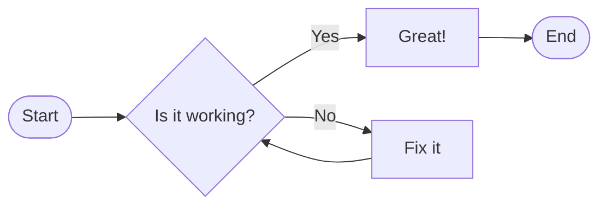

+++
title = 'Diagram Testing'
date = 2023-02-15T09:00:00-07:00
draft = false
description = 'A test page demonstrating Goat ASCII art and Mermaid diagram support.'
tags = ['diagrams', 'mermaid', 'test']
categories = ['Features']
+++


# Hey

## Goat Diagrams

```goat
+--------+
| Hey 1  |--+
| Test 2 |  |   +------+   +------+   +------+
+--------+  +-->| Test |-->| Test |-->| Test |
            |   +------+   +------+   +------+
+--------+  |
| Hey 2  |--+
+--------+
```

## Mermaid Diagrams


